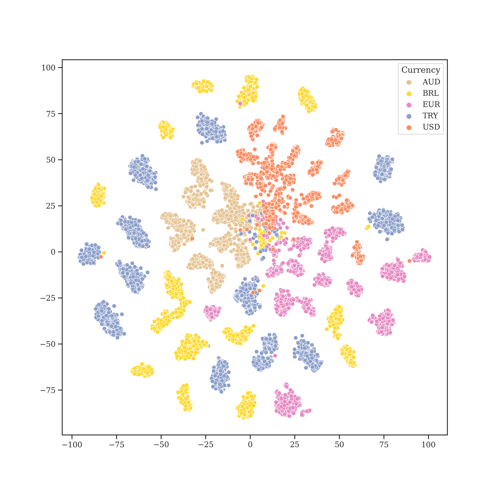

# BankNote-Net: Open Dataset for Assistive Currency Recognition

Millions of people around the world have low or no vision. Assistive software applications have been developed for a variety of day-to-day tasks, including currency recognition. To aid with this task, we present BankNote-Net, an open dataset for assistive currency recognition. 
The dataset consists of a total of **24,816 embeddings** of banknote images captured in a variety of assistive scenarios, spanning **17 currencies** and **112 denominations**. These compliant embeddings were learned using supervised contrastive learning and a MobileNetV2 architecture, and they can be used to train and test specialized downstream models for any currency, including those not covered by our dataset or for which only a few real images per denomination are available (few-shot learning). We deploy a variation of this model for public use in the last version of the [Seeing AI](https://www.microsoft.com/en-us/ai/seeing-ai) app developed by Microsoft, which has over a 100 thousand monthly active users.

If you make use of this dataset or pre-trained model in your own project, **please consider referencing this GitHub repository and citing our [paper](https://arxiv.org/pdf/2204.03738.pdf)**:
```
@article{oviedoBankNote-Net2022,
  title   = {BankNote-Net: Open Dataset for Assistive Currency Recognition},
  author  = {Felipe Oviedo, Srinivas Vinnakota, Eugene Seleznev, Hemant Malhotra, Saqib Shaikh & Juan Lavista Ferres},
  journal = {https://arxiv.org/pdf/2204.03738.pdf},
  year    = {2022},
}
```

## Data Structure

The dataset data structure consists of 256-dimensional vector embeddings with additional columns for currency, denomination and face labels, as explained in the [data exploration](./src/data_exploration.ipynb) notebook. 
The dataset is saved as **24,826 x 258** flat table in [feather](./data/banknote_net.feather) and [csv](./data/banknote_net.csv) file formats. Figure 1 presents some of these learned embeddings.
<figure>
  </center>
  <figcaption style="text-align: justify"> <b>Figure 1:</b> t-SNE representations of the BankNote-Net embeddings for a few selected currencies.
  </figcaption>
</figure>

## Setup and Dataset Usage

1. **Install** requirements.
    
    Please, use the conda environment file [env.yaml](./env.yaml) to install the right dependencies.

     ```
     # Create conda environment
     conda create env -f env.yaml

     # Activate environment to run examples
     conda activate banknote_net
     ```


2. **Example 1**: Train a shallow classifier directly from the dataset embeddings for a currency available in the dataset. For inference, images should be encoded first using the keras MobileNet V2 pre-trained [encoder model](./models/banknote_net_encoder.h5).

    Run the following file from root: [train_from_embedding.py](./src/train_from_embedding.py)
    
      ```
      python src/train_from_embedding.py --currency AUD --bsize 128 --epochs 25 --dpath ./data/banknote_net.feather
      ```
    
      ```
        usage: train_from_embedding.py [-h] --currency
                                    {AUD,BRL,CAD,EUR,GBP,INR,JPY,MXN,PKR,SGD,TRY,USD,NZD,NNR,MYR,IDR,PHP}
                                    [--bsize BSIZE] [--epochs EPOCHS]
                                    [--dpath DPATH]

        Train model from embeddings.

        optional arguments:
        -h, --help            show this help message and exit
        --currency {AUD,BRL,CAD,EUR,GBP,INR,JPY,MXN,PKR,SGD,TRY,USD,NZD,NNR,MYR,IDR,PHP}, --c {AUD,BRL,CAD,EUR,GBP,INR,JPY,MXN,PKR,SGD,TRY,USD,NZD,NNR,MYR,IDR,PHP}
                                String of currency for which to train shallow
                                classifier
        --bsize BSIZE, --b BSIZE
                                Batch size for shallow classifier
        --epochs EPOCHS, --e EPOCHS
                                Number of epochs for training shallow top classifier
        --dpath DPATH, --d DPATH
                                Path to .feather BankNote Net embeddings
                            
      ```

3. **Example 2**: Train a classifier on top of the BankNote-Net pre-trained [encoder model](./models/banknote_net_encoder.h5) using images in a custom directory. Input images must be of size 224 x 224 pixels and have square aspect ratio. For this example, we use a couple dozen images spanning 8 classes for Swedish Krona, structured as in the [example_images/SEK](./data/example_images/SEK) directory, that contains both training and validation images.

    Run the following file from root: [train_custom.py](./src/train_custom.py)
    
      ```
      python src/train_custom.py --bsize 4 --epochs 25 --data_path ./data/example_images/SEK/ --enc_path ./models/banknote_net_encoder.h5
      ```
    
      ```
    usage: train_custom.py [-h] [--bsize BSIZE] [--epochs EPOCHS]
                        [--data_path DATA_PATH] [--enc_path ENC_PATH]

    Train model from custom image folder using pre-trained BankNote-Net encoder.

    optional arguments:
    -h, --help            show this help message and exit
    --bsize BSIZE, --b BSIZE
                            Batch size
    --epochs EPOCHS, --e EPOCHS
                            Number of epochs for training shallow top classifier.
    --data_path DATA_PATH, --data DATA_PATH
                            Path to folder with images.
    --enc_path ENC_PATH, --enc ENC_PATH
                            Path to .h5 file of pre-trained encoder model.                       
      ```

4. **Example 3**: Perform inference using the SEK few-shot classifier of Example 2, and the validation images on [example_images/SEK/val](./data/example_images/SEK/val)

    Run the following file from root: [predict_custom.py](./src/predict_custom.py), returns encoded predictions.
    
      ```
        python src/predict_custom.py --bsize 1 --data_path ./data/example_images/SEK/val/ --model_path ./src/trained_models/custom_classifier.h5
      ```
    
      ```
        usage: predict_custom.py [-h] [--bsize BSIZE] [--data_path DATA_PATH]
                                [--model_path MODEL_PATH]

        Perform inference using trained custom classifier.

        optional arguments:
        -h, --help            show this help message and exit
        --bsize BSIZE, --b BSIZE
                                Batch size
        --data_path DATA_PATH, --data DATA_PATH
                                Path to custom folder with validation images.
        --model_path MODEL_PATH, --enc MODEL_PATH
                                Path to .h5 file of trained classification model.                           
      ```

## License for Dataset and Model

Copyright (c) Microsoft Corporation. All rights reserved.

The dataset is open for anyone to use under the [CDLA-Permissive-2.0](https://spdx.org/licenses/CDLA-Permissive-2.0.html) license. The embeddings should not be used to reconstruct high resolution banknote images.

## Contributing

This project welcomes contributions and suggestions.  Most contributions require you to agree to a
Contributor License Agreement (CLA) declaring that you have the right to, and actually do, grant us
the rights to use your contribution. For details, visit https://cla.opensource.microsoft.com.

When you submit a pull request, a CLA bot will automatically determine whether you need to provide
a CLA and decorate the PR appropriately (e.g., status check, comment). Simply follow the instructions
provided by the bot. You will only need to do this once across all repos using our CLA.

This project has adopted the [Microsoft Open Source Code of Conduct](https://opensource.microsoft.com/codeofconduct/).
For more information see the [Code of Conduct FAQ](https://opensource.microsoft.com/codeofconduct/faq/) or
contact [opencode@microsoft.com](mailto:opencode@microsoft.com) with any additional questions or comments.

## Trademarks

This project may contain trademarks or logos for projects, products, or services. Authorized use of Microsoft 
trademarks or logos is subject to and must follow 
[Microsoft's Trademark & Brand Guidelines](https://www.microsoft.com/en-us/legal/intellectualproperty/trademarks/usage/general).
Use of Microsoft trademarks or logos in modified versions of this project must not cause confusion or imply Microsoft sponsorship.
Any use of third-party trademarks or logos are subject to those third-party's policies.
